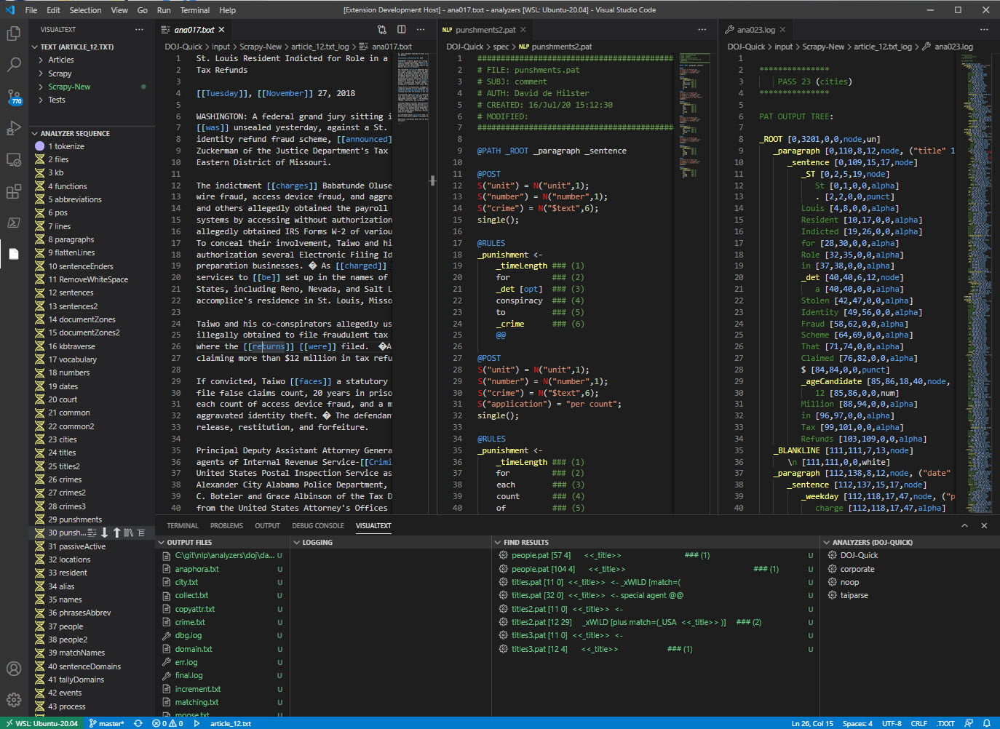

# NLP++ Language Extension README

This is a language extension for VSCode for NLP++ to recreate the functionality of VisualText which lived Microsoft Windows only.

## Features

The NLP++ language extension allows for the fast development of NLP++ analyzers allowing users to:

* Quickly generate and edit NLP++ code
* Display the syntax tree in insightful ways
* Highlight text that has matched rules in each pass
* Display the knowledge base at strategic places in the analayzer sequence
* Easily edit and modify the pass sequence and texts to be analyze
* Display syntax errors to NLP++

## Requirements

The NLP++ Language extension depends on the NLP-ENGINE on the [VisualText github repository.](https://gihub.com/VisualText/nlp-engine) The executable nlp.exe

## Extension Settings

There are several json files that hold configuration and states for VisualText for VSCode:

* state.json - in the analyzer folder holding information such as the path to nlp.exe and the last analyzer selected
* state.json - in each analyzer directory holding the last text processed

## General state.json

This json file holds information you need to fill in.

    {
        "visualText": [
            {
                "name": "Analyzer",
                "type": "state",
                "engineDir": "/YOUR-PATH-HERE/nlp-engine/",
                "currentAnalyzer": "/YOUR-PATH-HERE/nlp-engine/analyzers/DOJ-Quick",
                "username": "Your Name Here"
            }
        ]
    }

## Analyzer state.json

This file will automatically get generated when a new analyzer is created in VisualText VSCode.

    {
        "visualText": [
            {
                "name": "Analyzer",
                "type": "state",
                "currentTextFile": "/YOUR-PATH-HERE/nlp-engine/analyzers/corporate/input/Dev/Sold.txt",
                "currentPassFile": "/YOUR-PATH-HERE/nlp-engine/analyzers/corporate/spec/lookup.pat"
            }
        ]
    }

## Known Issues

There are many details in the windows version of VisualText that are yet to be implemented in the VSCode version.

## Release Notes

Users appreciate release notes as you update your extension.

### 1.0.0

Initial release of the NLP++ Language Extension for VSCode