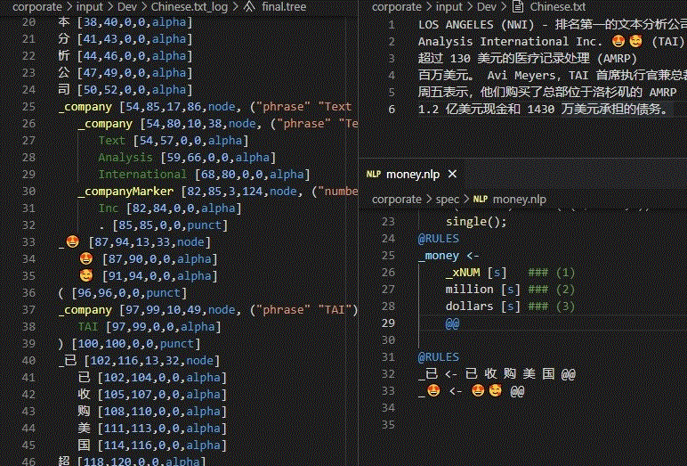
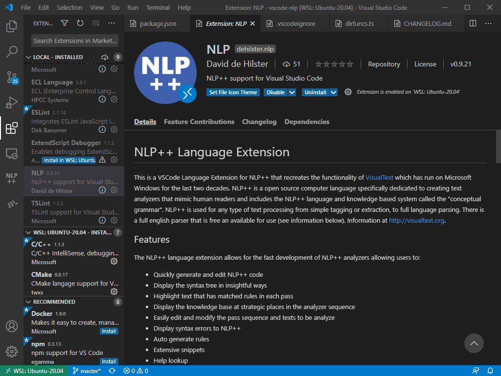

# NLP++ Language Extension

## First Textbook on the NLP++ Programming Langauge

The first textbook on NLP++ is now available world-wide by [BPB Online](https://book.visualtext.org). NLP++ can replace LLMs when used in agentic flows. The code must be written by a human like any other programming language and this book will facilitate this process. NLP++ is no a statistical system that needs training. It relies on the ingenuity of the programmer to create a program that can parse text and extract information in a deterministic way.

In November of 2023, the [Natural Language Understanding Global Initiative](http://nluglob.org) was born to help coordinate the growing efforts of [students, faculty, and researchers](https://nluglob.org) in the open-source natural language understanding community.

## Version 3 announcement

Version 3 adds support for compiling analyzers and the knowledge base (KB).

This provides two major advantages:
- Faster execution.
- Protection of native NLP++ source code when delivering analyzers to customers who do not have access to NLP++ source.

## Version 2 milestone

On December 29, 2022, Version 2 introduced the ability to build and use the analyzer view together with the updated NLP-ENGINE.

## Tutorial Videos

Many of you have been asking for tutorial videos on NLP++ and here is the first set. More coming soon...
1. NLP++ tutorial videos: http://tutorials.visualtext.org
1. Analyzers used in the videos: https://github.com/VisualText/nlp-tutorials
1. VisualText tutorial videos: http://vttutorials.visualtext.org

## NLP Discourse Forum

Because of NLP++ being 100% open-source, [Discourse](https://www.discourse.org/) has donated a free NLP Forum for NLP++: [https://nlp.discourse.group](https://nlp.discourse.group). There, in the community, users can ask questions and discuss NLP++ and VisualText.

## Only Computer Language Dedicated to Text and Natural Language Processing
NLP++ is the only computer language in the world exclusively dedicated to natural language processing. It allows for creating digital human readers that use linguistic and world knowledge to parse, tag, interpret, and extract information from text.

## NLP++ and VisualText Now Unicode

The NLP-Engine for NLP++ now works with Unicode (UTF8 via the ICU C++ Package) including the ability to work with emojis.

## Quick Video Guides
Find [quick video guides](http://tutorials.visualtext.org/) on how to install and use VisualText including a "hello world" video as well as an in-depth tour of VisualText.

## Introduction

This is a VSCode Language Extension for NLP++ that recreates the functionality of [VisualText](http://visualtext.org) which has run on Microsoft Windows for the last two decades. NLP++ is a open source computer language designed specifically for text and natural language processing. This extension runs on Linux, Windows, and MacOS.

The language extension and the required NLP-ENGINE run on Linux, Windows, and MacOS.

## Features

The VSCode NLP++ Language Extension allows for the fast development of NLP++ analyzers allowing users to:

* Quickly generate and edit NLP++ code
* Display the syntax tree in insightful ways
* Highlight text that has matched rules in each pass
* Display the knowledge base at strategic places in the analyzer sequence
* Easily edit and modify the pass sequence and texts to be analyzed
* Display syntax errors to NLP++
* Compile analyzers and KBs to C++ libraries for faster execution and source-code protection in customer deployments
* Auto generate rules
* Extensive snippets
* Help lookup

## NLP++ Example Analyzers

Example analyzers can be found in the "analyzers" folder in the NLP-ENGINE folder.

## Requirements

In order to use the VSCode NLP++ Language Extension, the NLP-ENGINE which is in the form of an executable and directory need to be present. Version one now includes this as part of the NLP language extension.

## NLP Engine Overview

The NLP-ENGINE now comes with the NLP++ Language extension but is available separately from the [VisualText github repository](https://github.com/VisualText/nlp-engine). The engine can run as a stand alone executable outside of the language extension.

### Types of Analyzers Commonly Written Using NLP++

There are many types of analyzers that are written by NLP++ programmers including:

* Tagging of text
* Extract emails, dates, addresses, etc from unstructured text
* Entity Extraction
* Full NLP Parsing
* Sentiment analysis
* OCR Cleanup
* Extraction of data from messy text
* Autogenerate snippets from documentation

### Analyzer state.json

This file will automatically get generated when a new analyzer is created in VisualText VSCode. It is located in the .vscode directory under the folder for an individual analyzer.

    {
        "visualText": [
            {
                "name": "Analyzer",
                "type": "state",
                "currentTextFile": "/YOUR-PATH-HERE/nlp-engine/analyzers/corporate/input/Dev/Sold.txt",
                "currentPassFile": "/YOUR-PATH-HERE/nlp-engine/analyzers/corporate/spec/lookup.pat"
            }
        ]
    }

## Known Issues

Click [here](https://github.com/VisualText/vscode-nlp/issues) for known issues.

## Release Notes

For the complete list of changes and release notes, click [here](https://marketplace.visualstudio.com/items/dehilster.nlp/changelog).

### 3.0.0
Added support for compiling analyzers and the knowledge base (KB). Benefits include faster execution and protection of native NLP++ source code when analyzers are distributed to customers without access to the NLP++ source.

### 2.49.6
Now has different colorization for light and dark themes.

### 2.48.5
Opens the local html files in the browser instead of online.

### 2.47.0
Fixing display for light themes. This is not complete. There must be a way to make it automatifc for textmate colorization. See settings-light.json.

### 2.46.1
Put add mod back into the sequence view.

### 2.45.5
Added load python library files.

### 2.44.4
No longer displaying old KB files.

### 2.43.8
Fixing duplicate pass with folders, the N("$text",1) snippet, and copying context line from file above.

### 2.43.0
Added file comparison to library files in the sequence.

### 2.42.4
Allows for selecting multiple analyzer blocks when creating analyzer and to insert analyzer blocks into an existing sequence.

### 2.40.4
Fixed folder creation and moving.

### 2.39.0
Added highlighting of dictionary matches.

### 2.36.4
Added capability to call Python scripts that run on the text in a text window.

### 2.35.0
Reorganization of library dictionaries, kbs, and mod files

### 2.34.2
Added Portuguese dictionaries in KB context menu.

### 2.33.2
Updated vscode extension path for linux.

### 2.32.3
Added readme files editing in Analyzer window anywhere. Misc fixes.

### 2.31.3
When loading an analyzer, check to see if the hier.kb file needs updating (added the "emoji" path recently).

### 2.30.1
Can now create an ECL file.

### 2.29.1
Removed icu library transfers for Linux and Macos because no longer needed.

### 2.28.11
Fixed error display (again)

### 2.27.3
Overhauled the reformat rule in general. It also now includes the suggested node and ending @@. Also, it now has reformat to one line and reformat with paren attributes listed on separate lines.

### 2.26.2
Added [HPCC Systems](https://github.com/hpcc-systems) manifest file generation to the analyzer view. This allows for sending NLP++ files to the HPCC Server to run using the HPCC Systems NLP++ Plugin.

### 2.25.7
Added fast load option for the TextView for large number of files

### 2.24.6
Can now display fired rules from dictionaries.

# Development

## VSCode Language Extension

Follow these instructions to install the development code for VSCode extension:

    git clone https://github.com/VisualText/vscode-nlp.git
    cd vscode-nlp
    npm install
    npm run watch
    
At which point you can edit the sources and launch debug sessions via F5 and included launch configurations.

## NLP Engine

The NLP Engine which is written in C++ is also open source and can be downloaded in development mode. You can find how to download and develop the NLP Engine code at: [https://github.com/VisualText/nlp-engine](https://github.com/VisualText/nlp-engine)

# License

[MIT](https://github.com/VisualText/vscode-nlp/blob/master/LICENSE)
