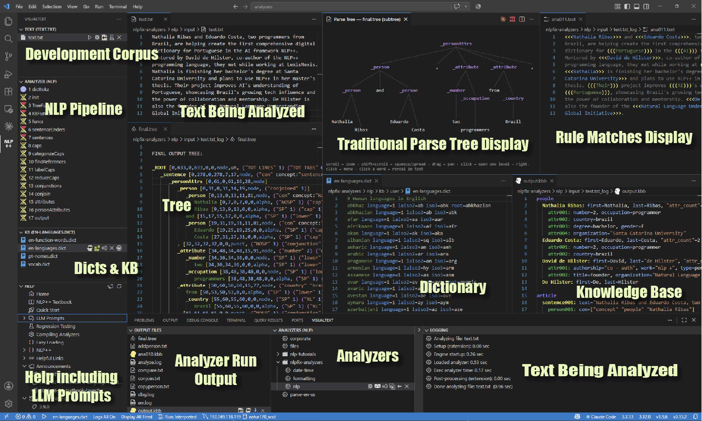
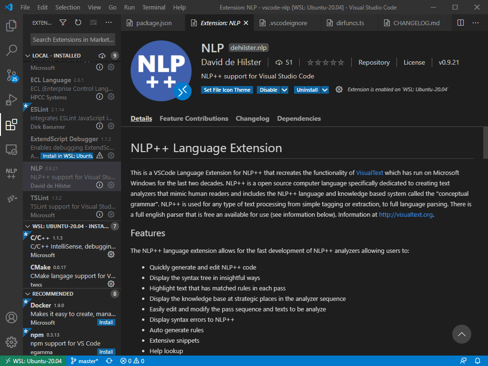

# NLP++ Language Extension

Build, debug, and ship **glass-box** text analyzers in Visual Studio Code.

[NLP++](https://visualtext.org/nlp/) is the only programming language built exclusively for text and natural language processing. This extension brings the full [VisualText](http://visualtext.org) development environment — which ran on Windows for two decades — into VS Code on **Windows, Linux, and macOS**, and bundles the NLP-ENGINE that runs it. Build up a parse tree, consult your dictionaries and knowledge bases, watch every rule fire, then compile the whole analyzer to a native library you can ship.

## Why NLP++

NLP++ analyzers are *deterministic*: the same input always produces the same output, from code a human wrote and any human can read. There is no model, no training, and no inference — just linguistic and world knowledge you encode and can correct. That makes NLP++ the right tool where the other two options run out:

| | Regex | LLMs | NLP++ |
|---|---|---|---|
| Deterministic | yes | no | **yes** |
| Auditable — you can see *why* | barely | no | **yes** |
| Linguistic structure | none | **mimicked, never represented** | **an explicit parse tree** |
| Carries world knowledge | no | **associations, not knowledge** | **yes — dictionaries and a KB you edit** |
| Fixable when it's wrong | rewrite the pattern | **no guarantee it can be fixed** | **go to the code that did it and change it** |
| Cost per document | free | **per token, forever** | **free if you curate it yourself — far below token prices if you don't** |

Regex has no notion of language at all and shatters on real text. LLMs are subtler: they emit text that is *consistent with* linguistic structure without ever building any. The fluency is real; the analysis is not. There is no tree inside, no constituent, no labeled node — nothing to point at, query, or correct, because nothing was ever represented. What looks like understanding is a very good imitation of its output. The same goes for what a model appears to *know*: statistical association over a corpus yields true statements often and false ones with identical confidence, and there is no concept to look up and no assertion to correct. NLP++ builds both the structure and the knowledge explicitly, which is why you can inspect them — and why you cannot pin an LLM down, audit it, or hold it to a spec.

The difference that matters most is fixability. **In a statistical system there is no guarantee a known error can be corrected at all.** You can re-prompt or retrain and hope; nothing in the machinery promises the specific failure goes away, nothing tells you *why* it happened, and a change that fixes it may silently break something that already worked. You are negotiating with a distribution. In NLP++, a wrong answer came from somewhere specific — a rule, a dictionary entry, a concept in the knowledge base, a line of code — and you can go there, read it, and change it. The fix stays fixed. That is why NLP++ belongs on the critical path of real software products, where a wrong answer has a cost and "the model said so" isn't an answer.

Then there is the bill. A compiled NLP++ analyzer is native code running on hardware you already have — no tokens, no per-call metering, nothing that scales with your traffic. Curation is the only real cost in NLP++, and you get to choose how you pay it:

* **Write and curate it yourself, and it is free.** The analyzer, its dictionaries, and its knowledge bases are yours outright — reusable across projects, improving as you go, costing nothing per document at any volume.
* **Or use an analyzer someone already curated.** [NLPfix.ai](https://nlpfix.ai) offers ready-made NLP++ extractors as MCPs and APIs for the routine extraction work now handed to LLMs — deterministic, fixable, and on the order of **100× cheaper** than the tokens they replace.

Neither path is LLM pricing.

## What an NLP++ Analyzer Is Made Of

NLP++ is often called "rule-based," which undersells it badly. Rules are one of four things you write, and they are the least interesting on their own. An analyzer is a **sequence of passes** over a text, and each pass has all four available to it. All four are visible in the screenshot at the top of this page:

**The parse tree.** Not an output artifact — the working data structure. Each pass reads the tree left by the pass before it and builds on it, tokens becoming words, words becoming phrases, phrases becoming whatever your domain calls for. Nodes carry attributes you set and read. You can watch the tree grow pass by pass, and graph any part of it.

**Rules.** Patterns in `@RULES` regions that match a sequence of nodes and reduce them into a new one, with modifiers like `[min=0 max=2]`, `[opt]`, and `[layer=...]` controlling how they apply. This is the pattern-matching layer — and only that layer.

**Dictionaries and knowledge bases.** This is where NLP++ departs from every regex-shaped tool. Dictionaries carry word-level knowledge — part of speech, stem, inflection, semantic category — for as many words as you care to describe. The knowledge base is a hierarchy of **concepts** with attributes and relationships: the world knowledge your analyzer reasons with. Both are yours to author, inspect, edit, and version, and both can be built *at run time* by the analyzer itself. A concept added in pass 12 is there in pass 30.

**Functions and code.** `@CODE`, `@CHECK`, and `@POST` regions hold real procedural code — variables, control flow, arithmetic, string handling, file and database I/O — plus several hundred built-in functions whose whole purpose is reaching into the other three. `N("attr")` and `S("attr")` read numeric and string attributes off matched nodes; `findnode`, `pnvar`, and `addnode` walk and modify the tree; `dictfindword` and `dictgetword` consult the dictionaries; `findconcept`, `addconcept`, `addstrval`, `getstrval`, and `conceptpath` query and grow the knowledge base. A rule can fire, its `@POST` code can look the matched word up in a dictionary, check a concept in the KB, decide the match was wrong, and `fail()` it.

That last sentence is the point. **The four parts are one system**, and the accompanying functions are what make them one — a rule that consults world knowledge before it commits, code that reshapes the tree based on what a dictionary said. Statistical systems get that interplay by burying it in weights nobody can read. NLP++ gets it in code you wrote, and every part of it is glass-box: readable, testable, diffable, and fixable.

## NLP++ and LLMs

Using a probabilistic black box to build a deterministic glass box turns out to be an excellent trade. An LLM writes the NLP++; the NLP++ is what ships, and it never hallucinates. Version 3 of this extension was itself built that way — see [8 Weeks with Claude and NLP++](https://visualtext.org/8-weeks-with-claude-and-nlp/).

The extension ships an **LLM prompt library** to make that workflow concrete. Open the **Help** view and pick a prompt — it is filled in with your machine's paths, opened in an editor, and copied to your clipboard, ready to paste into Claude or any other assistant:

* **Prime Claude for NLP++** — points the assistant at the local function help and NLP++ reference so it stops guessing signatures
* **General pointers: Claude + NLP++** — how to work with an analyzer productively
* **From scratch: chemical formulas** — a worked example of building an extractor
* **Harden analyzer** — generate more test text and close the gaps it exposes
* **Create Dictionaries & KBs** — bulk-build lexicons and knowledge bases
* **Add missing words to the English dictionary**

Start with [Using Claude with NLP++](https://visualtext.org/using-claude-with-nlp/) for the step-by-step walkthrough.

## Getting Started

1. Install the extension from the Marketplace. **The NLP-ENGINE comes with it** — there is nothing else to download, and it keeps itself up to date.
2. Open (or create) a folder to hold your analyzers. Use **New Analyzer** in the Analyzer view and pick a template.
3. Drop a text file into the analyzer's `input` folder, select it in the **Text** view, and run the analyzer.
4. Open the resulting `.tree` file, or right-click it and choose **Graph Entire Tree**, to see exactly what matched and why.

New to NLP++? The [hello-world video](https://visualtext.org/hello-world-tutorial/) and the [tutorial videos](http://tutorials.visualtext.org) cover this ground in a few minutes.

## What's in the Extension

Version 3 has been the biggest chapter yet; [Everything New in Version 3](https://visualtext.org/nlp-in-vs-code-everything-new-in-version-3/) tells the long version. In brief:

### Write

* **IntelliSense** that knows where the cursor is — region markers, built-in functions, or rule elements
* **Signature help** for function calls, across passes
* **Hover documentation**, rendered as markdown right in the editor
* **Go to definition, find references, rename, and workspace symbol search** for rules, functions, and KB concepts — across every pass in the analyzer
* **Diagnostics** as you type: structural linting plus real engine errors mapped back to the line that caused them
* **Semantic highlighting** — identifiers colored by what they actually are — plus quick fixes for misspelled function names
* **Code folding** for regions and rules, a **document formatter** for `.nlp`/`.pat` files that reflows rules without touching your strings or comments, extensive **snippets**, and **rule auto-generation** from selected text
* Full **Unicode (UTF-8)** support, emojis included

  

### See what happened

* **Parse-tree graphics** — the syntax tree drawn as a linguistic tree, opening on the root and drilling down one node at a time. Right-click any node to reveal its text in the input file, expand or collapse a subtree, or graph just the phrase under the cursor.
* **Rule-match highlighting** — see which rules fired on which text, in every pass
* **Knowledge-base display** at any point in the analyzer sequence
* A **regression-test runner** with streaming pass/fail, and blessing of new expected output
* Drag-and-drop editing of the **pass sequence** and the texts being analyzed

### Ship

* **Compile Analyzer and KB** turns an analyzer and its knowledge base into a native shared library (`.dll` / `.so` / `.dylib`) in one command. Two things follow: **faster execution**, and **protection of your NLP++ source** — customers get a library, not your rules.
* **Granular targets** so you only rebuild what changed: the whole analyzer, **Compile KB** alone, or **Compile Analyzer Only** against an already-compiled KB.
* **Run modes** you toggle from the status bar — **Interpreted**, **Compiled**, **Compiled KB**, **Compiled Analyzer** — with compiled mode running natively on all three platforms.
* **Cloud compile is the default** (`compile.mode = "cloud"`): the extension ships your generated C++ to the [nlp-compile-service](https://github.com/VisualText/nlp-compile-service), which builds for Windows, Linux, and macOS on hosted runners and downloads the finished library. **No local C++ toolchain, CMake, or Visual Studio required.** Set `compile.mode = "local"` to build on your own machine instead (needs CMake ≥ 3.16 and a platform toolchain).
* **Deploy Compiled Analyzer to Folder** exports a runnable, stripped-down analyzer — the native library, the lazy dictionaries and KBs, and any python-pass scripts — while leaving the `.nlp` source behind.

### Scale

* **Lazy dictionaries and knowledge bases**: `*-full.dict` / `*-full.kbb` files are binary-searched on disk one word at a time instead of being loaded whole, cutting memory and startup cost dramatically. They stay data files, never compiled in, so they behave identically interpreted or compiled.
* **Python passes** anywhere in the sequence — even before the tokenizer, to build a KB from a JSON file before analysis starts — and they run from the compiled library too, not just when interpreted.

## Beyond the Editor

An analyzer you build here doesn't have to run here. The same engine is available as:

* **[NLPPlus](https://pypi.org/project/NLPPlus/)** — Python package with native bindings, running in-process. For production Python.
* **[nlpplus](https://www.npmjs.com/package/nlpplus)** — the Node.js peer, a Node-API addon rather than a subprocess. For production Node.
* **`NLPEngine` classes for Python and TypeScript** — lightweight wrappers that shell out to `nlp.exe`, fine for scripting.
* **Command-line engine bundles** per OS, from the [nlp-engine repository](https://github.com/VisualText/nlp-engine).

All of them run analyzers interpreted or compiled. [Every Way to Run an NLP++ Analyzer](https://visualtext.org/every-way-to-run-an-nlp-analyzer/) compares them.

## Example Analyzers

Example analyzers — including a full English parser — ship in the `analyzers` folder of the NLP-ENGINE.

Common uses: entity extraction, tagging, full NLP parsing, pulling emails/dates/addresses out of unstructured text, sentiment analysis, OCR cleanup, extraction from messy data, and autogenerating snippets from documentation.

## Learn NLP++

* **[The NLP++ textbook](https://book.visualtext.org)** — the first book on the language, from BPB Online, by David de Hilster and Amnon Meyers
* **[NLP++ tutorial videos](http://tutorials.visualtext.org)** and the [analyzers used in them](https://github.com/VisualText/nlp-tutorials)
* **[VisualText tutorial videos](http://vttutorials.visualtext.org)** — installation, hello-world, and an in-depth tour
* **[NLP++ Discourse forum](https://nlp.discourse.group)** — donated free to the project by [Discourse](https://www.discourse.org/), for questions and discussion

## The Community

NLP++ is 100% open source and coordinated by two organizations:

* **[The NLP Foundation](https://nlp.foundation)** pursues complete symbolic understanding of human language — deterministic, inspectable systems whose knowledge humans author rather than scrape. Its roadmap runs from domain-specific applications, through governed dictionaries and knowledge bases for major languages, to general linguistic parsers written in NLP++.

* **[The Natural Language Understanding Global Initiative](http://nluglob.org)**, born in November 2023, coordinates the growing efforts of students, faculty, and researchers in the open-source NLU community.

## Further Reading

* [NLP++ in VS Code: Everything New in Version 3](https://visualtext.org/nlp-in-vs-code-everything-new-in-version-3/)
* [Using Claude with NLP++](https://visualtext.org/using-claude-with-nlp/) · [8 Weeks with Claude and NLP++](https://visualtext.org/8-weeks-with-claude-and-nlp/)
* [Why NLP++ Is the Only Technology That Can Ultimately Replace LLMs](https://visualtext.org/why-nlp-is-the-only-technology-that-can-ultimately-replace-llms/)
* [Comparing LLMs with NLP++](https://visualtext.org/comparing-llms-with-nlp/) · [NLP++ Versus ML](https://visualtext.org/nlp-versus-ml/)
* [Inside Version 3 of the VisualText NLP Engine](https://visualtext.org/inside-version-3-of-the-visualtext-nlp-engine-compiled-cloud-built-on-npm-and-ai-assisted/)
* [More on the VisualText blog](https://visualtext.org/category/blog/)

## Telemetry

This extension can send **anonymous usage data** to help prioritize features and catch errors in the field. It records only counts and metadata. It **never** sends file contents, analyzer/KB/dictionary source, file names, paths, analyzer names, or any text being analyzed — and never the text of an error message, since those routinely quote paths and rule source.

What is recorded:

- **Environment**, attached to every record: extension version, VS Code version, OS platform and CPU architecture, the NLP++ engine version once detected, and whether the window is local, remote (WSL/SSH), or web.
- **Sessions**: an activation record noting whether this was a fresh install, an upgrade (and from which version), or an ordinary relaunch.
- **Feature usage**: which extension commands and language features (hover, go-to-definition, find references, rename, completion, signature help) were used, as periodic counts. Command identifiers are fixed strings from this extension — never anything you typed.
- **Analyzer runs**: run mode, dev mode, whether the target was a file or a folder, and the timing breakdown already shown in the log view (setup, engine startup, KB load, analyzer load, exec, post-processing). On failure, only whether it was a syntax or execution error.
- **Compiles**: target and route (local or cloud), success or failure, elapsed time, and for failures a fixed stage name such as `no-cmake`, `codegen`, or `release-not-found`. For cloud compiles: the platform key, whether the build was a cache hit, runner wait time, and the payload size in KB. Deploying a compiled analyzer records how many lazy KB files and python scripts were copied — never the destination or any file name.
- **Engine updates**: which component was downloaded or unzipped, its public release tag, elapsed time, and whether it succeeded.
- **Regression runs**: number of files, and how many passed, failed, were missing, or were blessed.

Telemetry respects two independent opt-outs, and sends nothing if either is off:

- VS Code's global `telemetry.telemetryLevel` setting (`off` disables all extension telemetry), and
- the extension's own `nlp.telemetry.enable` setting.

## Known Issues and Release Notes

Known issues live in the [issue tracker](https://github.com/VisualText/vscode-nlp/issues). Every release is documented in the [changelog](https://marketplace.visualstudio.com/items/dehilster.nlp/changelog).

## Development

The extension's TextMate grammars live in a submodule, so clone with `--recurse-submodules`:

    git clone --recurse-submodules https://github.com/VisualText/vscode-nlp.git
    cd vscode-nlp
    npm install
    npm run watch

Then edit the sources and launch a debug session with F5 using the included launch configurations.

The **NLP Engine** (C++) is open source as well: [VisualText/nlp-engine](https://github.com/VisualText/nlp-engine). The **grammars** are at [VisualText/nlpplus-tmbundle](https://github.com/VisualText/nlpplus-tmbundle), packaged separately so GitHub, Shiki, `bat`, and other tools can colorize NLP++ with exactly what this extension ships.

## License

[MIT](https://github.com/VisualText/vscode-nlp/blob/master/LICENSE)
