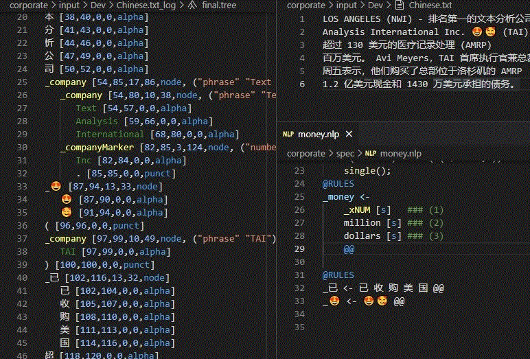

# NLP++ Language Extension

In November of 2023, the [Natural Language Understanding Global Initiative](http://nluglob.org) was born to help coordinate the growing efforts of [students, faculty, and researchers](https://nluglob.org/category/people/) from around the world who are developing dictionaries, knowledge bases, and analyzers using NLP++, VisualText, and the Conceptual Grammar.

## Version 2 Released

On December 29, 2022, version 2 was released. Since the NLP++ language extension is updated frequently, the new version is more of a formality. The major change is the ability to build and use the .kbb files to load a knowledge base. This is in conjunction with version 2 of the NLP Engine which is necessary for reading .kbb files into the knowledge base.

## Tutorial Videos

Many of you have been asking for tutorial videos on NLP++ and here is the first set. More coming soon...
1. NLP++ tutorial videos: http://tutorials.visualtext.org
1. Analyzers used in the videos: https://github.com/VisualText/nlp-tutorials
1. VisualText tutorial videos: http://vttutorials.visualtext.org

## Glitter Chat

 Join our glitter chat room for VisualText!

## Only Computer Language Dedicated to Natural Language Processing
NLP++ is the only computer language in the world exclusively dedicated to natural language processing. It allows for creating digital human readers that use linguistic and world knowledge to parse and understand text. Whether it be for extracting or marking up "messy" text or full-blown NLP understanding, this language allows for "anything thinkable".

## NLP++ and VisualText Now Unicode

The NLP-Engine for NLP++ now works with Unicode (UTF8 via the ICU C++ Package) including the ability to work with emojis.

## Quick Video Guides
Find [quick video guides](http://tutorials.visualtext.org/) on how to install and use VisualText including a "hello world" video as well as an in-depth tour of VisualText.

## Introduction

This is a VSCode Language Extension for NLP++ that recreates the functionality of [VisualText](http://visualtext.org) which has run on Microsoft Windows for the last two decades. NLP++ is a open source computer language specifically dedicated to creating text analyzers that mimic human readers and includes the NLP++ language and knowledge based system called the "conceptual grammar". NLP++ is used for any type of text processing from simple tagging or extraction, to full language parsing. There is a full english parser that is free an available for use (see information below).

The language extension and the required NLP-ENGINE run on Linux, Windows, and MacOS.

## Features

The VSCode NLP++ Language Extension allows for the fast development of NLP++ analyzers allowing users to:

* Quickly generate and edit NLP++ code
* Display the syntax tree in insightful ways
* Highlight text that has matched rules in each pass
* Display the knowledge base at strategic places in the analyzer sequence
* Easily edit and modify the pass sequence and texts to be analyze
* Display syntax errors to NLP++
* Auto generate rules
* Extensive snippets
* Help lookup

## NLP++ Example Analyzers

Example analyzers can be found in the "analyzers" folder in the NLP-ENGINE folder.

## Requirements

In order to use the VSCode NLP++ Language Extension, the NLP-ENGINE which is in the form of an executable and directory need to be present. Version one now includes this as part of the NLP language extension.

## NLP Engine Overview

The NLP-ENGINE now comes with the NLP++ Language extension but is available separately from the [VisualText github repository](https://github.com/VisualText/nlp-engine). The engine can run as a standalone executable (nlp.exe) that runs on Linux, Windows, and MacOS or it can be embedded into c++ code.

### Types of Analyzers Commonly Written Using NLP++

There are many types of analyzers that are written by NLP++ programmers including:

* Tagging of text
* Extract emails, dates, addresses, etc from unstructured text
* Entity Extraction
* Full NLP Parsing
* Sentiment analysis
* OCR Cleanup
* Extraction of data from messy text
* Autogenerate snippets from documentation

### Analyzer state.json

This file will automatically get generated when a new analyzer is created in VisualText VSCode. It is located in the .vscode directory under the folder for an individual analyzer.

    {
        "visualText": [
            {
                "name": "Analyzer",
                "type": "state",
                "currentTextFile": "/YOUR-PATH-HERE/nlp-engine/analyzers/corporate/input/Dev/Sold.txt",
                "currentPassFile": "/YOUR-PATH-HERE/nlp-engine/analyzers/corporate/spec/lookup.pat"
            }
        ]
    }

## Known Issues

Click [here](https://github.com/VisualText/vscode-nlp/issues) for known issues.

## Release Notes

For the complete list of changes and release notes, click [here](https://marketplace.visualstudio.com/items/dehilster.nlp/changelog).

### 2.42.1
Allows for selecting multiple analyzer blocks when creating analyzer and to insert analyzer blocks into an existing sequence.

### 2.40.4
Fixed folder creation and moving.

### 2.39.0
Added highlighting of dictionary matches.

### 2.36.4
Added capability to call Python scripts that run on the text in a text window.

### 2.35.0
Reorganization of library dictionaries, kbs, and mod files

### 2.34.2
Added Portuguese dictionaries in KB context menu.

### 2.33.2
Updated vscode extension path for linux.

### 2.32.3
Added readme files editing in Analyzer window anywhere. Misc fixes.

### 2.31.3
When loading an analyzer, check to see if the hier.kb file needs updating (added the "emoji" path recently).

### 2.30.1
Can now create an ECL file.

### 2.29.1
Removed icu library transfers for Linux and Macos because no longer needed.

### 2.28.11
Fixed error display (again)

### 2.27.3
Overhauled the reformat rule in general. It also now includes the suggested node and ending @@. Also, it now has reformat to one line and reformat with paren attributes listed on separate lines.

### 2.26.2
Added [HPCC Systems](https://github.com/hpcc-systems) manifest file generation to the analyzer view. This allows for sending NLP++ files to the HPCC Server to run using the HPCC Systems NLP++ Plugin.

### 2.25.7
Added fast load option for the TextView for large number of files

### 2.24.6
Can now display fired rules from dictionaries.

### 2.23.0
Enhanced search for sequence files.

### 2.22.2
Can now turn off auto updates.

### 2.21.0
Can now choose log flag for all logs, final logs only, and completely silent.

### 2.20.10
One-level sequence folders should now be working.

### 2.19.4
Adding testing files for regression testing.

### 2.18.0
If a pass exists, replace it when inserting a library pass. This in effect "updates" the file which is often the case with KBFuncs.nlp.

### 2.17.13
Added mod files allowing for saving and loading multiple files together in one file.

### 2.16.3
Put active toggle on sequence passes.

# Development

## VSCode Language Extension

Follow these instructions to install the development code for VSCode extension:

    git clone https://github.com/VisualText/vscode-nlp.git
    cd vscode-nlp
    npm install
    npm run watch
    
At which point you can edit the sources and launch debug sessions via F5 and included launch configurations.

## NLP Engine

The NLP Engine which is written in C++ is also open source and can be downloaded in development mode. You can find how to download and develop the NLP Engine code at: [https://github.com/VisualText/nlp-engine](https://github.com/VisualText/nlp-engine).

# License

[MIT](https://github.com/VisualText/vscode-nlp/blob/master/LICENSE)

