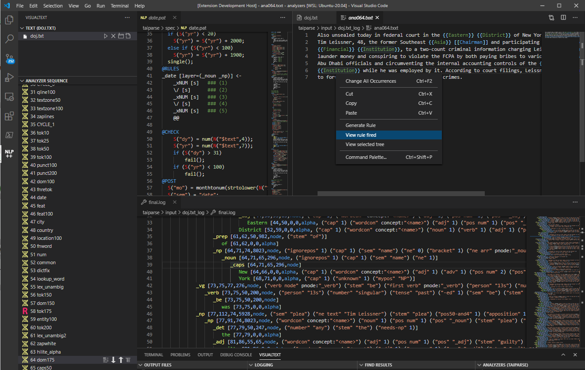

# NLP++ Language Extension

This is a language extension for VSCode for NLP++ to recreate the functionality of [VisualText](http://visualtext.org) which has run on Microsoft Windows for the last two decades. NLP++ is a computer language specifically dedicated to creating text analyzers that mimic human readers and includes the NLP++ language and knowledge based system called the "conceptual grammar". NLP++ is used for any type of text processing from simple tagging or extraction, to full language parsing. There is a full english parser that is free an available for use (see information below). Information at [http://visualtext.org](http://visualtext.org).

# ATTENTION:

Currently this extension is not working when published. We are aware of this problem and are trying to remedy it as quickly as possible. As soon as it has been resolved, the "preivew" mode will be lifted. **You can still preview it fully functional** by running the source code from our [VisualText github repository](https://gihub.com/VisualText/vscode-nlp) in development mode. Instructions can be found in the [Development](#Development) section of this page.

## Features

The NLP++ language extension allows for the fast development of NLP++ analyzers allowing users to:

* Quickly generate and edit NLP++ code
* Display the syntax tree in insightful ways
* Highlight text that has matched rules in each pass
* Display the knowledge base at strategic places in the analyzer sequence
* Easily edit and modify the pass sequence and texts to be analyze
* Display syntax errors to NLP++
* Auto generate rules
* Extensive snippets
* Help lookup

## Requirements

In order to use the VSCode NLP++ Language Extension, you need to install the NLP-ENGINE (Linux only for now, Windows and Mac versions coming soon). Example analyzers can be found in the NLP-ENGINE directory (see below).

### NLP Engine

The NLP++ Language extension depends on the NLP-ENGINE on the [VisualText github repository](https://gihub.com/VisualText/nlp-engine) which must be downloaded from github and compiled. The executable nlp.exe currently only compiles for Linux but can be run on Windows using the Windows Subsystem for Linux (see below). Native NLP-ENGINES for Windows and Mac are expected in the near future.

### Running on Windows

To run the NLP++ Language Extension on windows, you need:

1. Install VSCode onto windows
1. Install the VSCode Extension [Remote - WSL](https://marketplace.visualstudio.com/items?itemName=ms-vscode-remote.remote-wsl) in VSCode
1. Install [Windows Subsytem for Linux](https://docs.microsoft.com/en-us/windows/wsl/install-win10) onto windows
1. Install the [NLP-ENGINE](https://gihub.com/VisualText/nlp-engine) onto the Windows System for Linux
1. Click on the green "greater/less-than" icon on the lower left side of the VSCode status bar and choose Analyzers folder located inside the NLP-ENGINE folder on the Windows Subsystem for Linux
1. Run, edit, modify the example analyzers and create your own

### NLP++ Example Analyzers

Example analyzers can be found in the "analyzers" folder in the NLP-ENGINE folder

### Types of Analyzers Commonly Written Using NLP++

There are many types of analyzers that are written by NLP++ programmers including:

* Tagging of text
* Extract emails, dates, addresses, etc from unstructured text
* Entity Extraction
* Full NLP Parsing
* Sentiment analysis
* OCR Cleanup
* Extraction of data from messy text
* Autogenerate snippets from documentation

## Extension Settings

There are several json files that hold configuration and states for VisualText for VSCode:

* state.json - in the analyzer folder holding information such as the path to nlp.exe and the last analyzer selected
* state.json - in each analyzer directory holding the last text processed

### General state.json

This json file is located in the .vscode directory in a folder that holds analyzers for that workspace.

    {
        "visualText": [
            {
                "name": "Analyzer",
                "type": "state",
                "engineDir": "/YOUR-PATH-HERE/nlp-engine/",
                "currentAnalyzer": "/YOUR-PATH-HERE/nlp-engine/analyzers/DOJ-Quick"
            }
        ]
    }

### Analyzer state.json

This file will automatically get generated when a new analyzer is created in VisualText VSCode. It is located in the .vscode directory under the folder for an individual analyzer.

    {
        "visualText": [
            {
                "name": "Analyzer",
                "type": "state",
                "currentTextFile": "/YOUR-PATH-HERE/nlp-engine/analyzers/corporate/input/Dev/Sold.txt",
                "currentPassFile": "/YOUR-PATH-HERE/nlp-engine/analyzers/corporate/spec/lookup.pat"
            }
        ]
    }
    
## Development

You must have installed the NLP-ENGINE in order to use this VSCode extension. You can find how to install this at: [https://github.com/VisualText/vscode-nlp](https://github.com/VisualText/vscode-nlp).

Follow these instructions to install the development code for VSCode extension:

    cd /Some/Dev/Folder/
    git clone https://github.com/VisualText/vscode-nlp.git
    cd vscode-nlp
    npm install

At which point you can open the `vscode-nlp` folder within VS Code.

Next start the background build process by running the following command within a terminal session:

    npm run watch
    
At which point you can edit the sources and launch debug sessions via F5 and included launch configurations.

## Known Issues

There are many details in the windows version of VisualText that are yet to be implemented in the VSCode version.

## Release Notes

This language extension is dependent on the [NLP-ENGINE](https://github.com/VisualText/nlp-engine). Currently, the NLP-ENGINE only runs on Linux but can be used on windows uing the Windows Linux Subsystem.

### v0.9.13

We are currently trying to fix the problem of this extension not working when published.

## License

[MIT](https://github.com/VisualText/vscode-nlp/blob/master/LICENSE)

